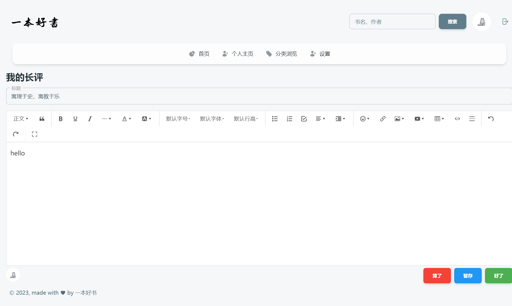

# BookRecommend

**"一本好书图"书推荐系统的前端仓库**

## 项目说明
- 项目使用[material-tailwind-dashboard-react](https://github.com/creativetimofficial/material-tailwind-dashboard-react)为基础模板
- [模板的相关文档](https://www.material-tailwind.com/docs/react/theming)
- 运行
  ```bash
  # 修改.env.development的地址为后端地址
  npm install
  npm run dev
  ```
- 后端仓库地址[BookRecommend_Back](https://github.com/EuDs63/BookRecommend_Back)

## 小组成员
- [EuDs63](https://github.com/EuDs63)
- [sun-yih](https://github.com/EuDs63)
- [SEUKURISU](https://github.com/SEUKURISU)
- [71121205](https://github.com/71121205)

## 部分界面截图
1. 用户首页
- 

2. 用户主页
- 

3. 书籍详情
- 

4. 长评编辑
- 

## 项目缺陷
- 主要是对豆瓣、Bangumi等网站的模仿，缺乏自己的特色功能
- 项目主题为图书推荐系统，但在推荐模块下的功夫较少

## 技术参考
- [SWR](https://swr.vercel.app/zh-CN/docs/getting-started)
- [Redux](https://redux.js.org/introduction/getting-started)
- [React](https://react.dev/learn)